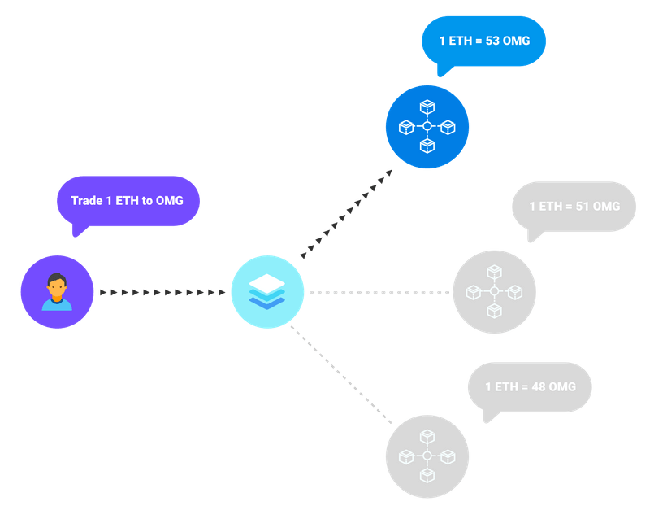

# Welcome KULAPers

[[toc]]

## Overview


# APIs

## Get best rate
- Endpoint
```
GET https://api.kulap.io/v1/api/rate/best-rate/toAmount
```

- Parameters

| Name       | Description          | Example             | Required   |
|------------|----------------------|---------------------|------------|
| from       | Token name           | ETH, DAI or WBTC    | ✔️          |
| to         | Token name           | ETH, DAI or WBTC    | ✔️          |
| fromAmount | Amount in wei format | 1000000000000000000 | ✔️          |
| accessKey  | Your api key         | xxxx                | ✔️          |
### Request

Query 1 ETH -> DAI
```shell
https://api.kulap.io/v1/api/rate/best-rate/toAmount?from=ETH&to=DAI&fromAmount=1000000000000000000&accessKey=xxxx
```

::: tip
For most tokens, you can convert the amount to wei format by, fromAmount * 10<sup>18</sup>.
:::

### Response
```json
Status: 200

{
  "FAST": {
    "gasPrice": "200",
    "gasLimit": 500000,
    "trade": {
      "routes": [
        2
      ],
      "fromAmount": "1000000000000000000",
      "toAmount": "459656594264950412134",
      "rate": "459.656594264950412134"
    }
  },
  "STD": {
    "gasPrice": "36",
    "gasLimit": 500000,
    "trade": {
      "routes": [
        2
      ],
      "fromAmount": "1000000000000000000",
      "toAmount": "459656594264950412134",
      "rate": "459.656594264950412134"
    }
  },
  "SLOW": {
    "gasPrice": "31",
    "gasLimit": 500000,
    "trade": {
      "routes": [
        2
      ],
      "fromAmount": "1000000000000000000",
      "toAmount": "459656594264950412134",
      "rate": "459.656594264950412134"
    }
  }
}

```
### Response detail
- Speed

| Key  | Description | Est. confirmation time |
|------|-------------|------------------------|
| FAST | fast        | < 2 minutes            |
| STD  | standard    | < 5 minutes            |
| SLOW | slow        | ~ 10 minutes           |

- Gas price
In gwei format, * 10<sup>9</sup> to convert to wei format.

## Trading Example (nodejs)
### Create project
```shell
mkdir kulapDex
cd kulapDex
npm init -y
npm i ethers axios
```
### index.js
```js
const ethers = require('ethers')
const axios = require('axios')
const BigNumber = ethers.BigNumber
const account = {
  address: '0xF7658F9b8C30637b9579A1BAbD06d9aC30Df5403',
  privateKey: '0x81874129a4c62bf828bb53a0c2d87786873dc8eab371bc6d9d8f831b301449da'
}
const KULAP_CONTRACT_ADDRESS = '0x3833cf2972394d636b1C5b80d34FeE1F17175b77'
const provider = ethers.providers.getDefaultProvider('rinkeby') // you can switch to mainnet when ready
const accessKey = 'xxx'
const abi = ["function trade(uint256 tradingProxyIndex, address src, uint256 srcAmount, address dest, uint256 minDestAmount, uint256 partnerIndex) payable returns(uint256)"]
const wallet = new ethers.Wallet(account.privateKey, provider)
const kulapDex = new ethers.Contract(KULAP_CONTRACT_ADDRESS, abi, wallet)
const bestRateApi = 'https://api.kulap.io/v1/api/rate/best-rate/toAmount'

async function main() {
  // Fetch best rate from api
  const fromToken = {
    code: 'ETH',
    address: '0xEeeeeEeeeEeEeeEeEeEeeEEEeeeeEeeeeeeeEEeE'
  }
  const toToken = {
    code: 'DAI',
    address: '0x6B175474E89094C44Da98b954EedeAC495271d0F'
  }
  const srcAmount = '10000000000000000' // 0.01 eth
  const result = await axios.get(bestRateApi, {
    params: {
      from: fromToken.code,
      to: toToken.code,
      fromAmount: srcAmount,
      accessKey: accessKey
    }
  })
  const bestRate = result.data
  console.log(bestRate)

  const tradingProxyIndex = bestRate.FAST.trade.routes[0]
  const src = fromToken.address
  const dest = toToken.address
  const minDestAmount = BigNumber.from(bestRate.FAST.trade.toAmount).mul('97').div('100').toString() // 3% slippage
  const partnerIndex = '0' // please provide your partner id, otherwise use 0
  console.table({tradingProxyIndex, src, srcAmount, dest, minDestAmount, partnerIndex})
  try {
    const overrides = {value: srcAmount}
    const transaction = await kulapDex.trade(
      tradingProxyIndex,
      src,
      srcAmount,
      dest,
      minDestAmount,
      partnerIndex,
      overrides
    )
    console.log({ transaction })
  } catch (error) {
    console.error(error)
  }
}

(async () => {
  await main()
})()
```
### Run
```shell
node index.js
```
### Result
```js
{
  transaction: {
    nonce: 0,
    gasPrice: BigNumber { _hex: '0x3b9aca00', _isBigNumber: true },
    gasLimit: BigNumber { _hex: '0x57e8', _isBigNumber: true },
    to: '0x3833cf2972394d636b1C5b80d34FeE1F17175b77',
    value: BigNumber { _hex: '0x00', _isBigNumber: true },
    data: '0x629e1c690000000000000000000000000000000000000000000000000000000000000002000000000000000000000000eeeeeeeeeeeeeeeeeeeeeeeeeeeeeeeeeeeeeeee0000000000000000000000000000000000000000000000000de0b6b3a76400000000000000000000000000006b175474e89094c44da98b954eedeac495271d0f000000000000000000000000000000000000000000000017eeca7adca662fdf90000000000000000000000000000000000000000000000000000000000000000',
    chainId: 4,
    v: 43,
    r: '0xbea4874249c50253403a973b6b7a5256b8ea5ff5caec119f9b627f0cfff517ae',
    s: '0x1e621ce976752ad2cfe31ecbd2b577a606b2727d5454bbcfa37b1609c4f12e35',
    from: '0xF7658F9b8C30637b9579A1BAbD06d9aC30Df5403',
    hash: '0x100b7746a2f0db334e588ebeda94d3f9fa2ece43f9e35b668aa6f9e1c5c4161b',
    wait: [Function]
  }
}
```