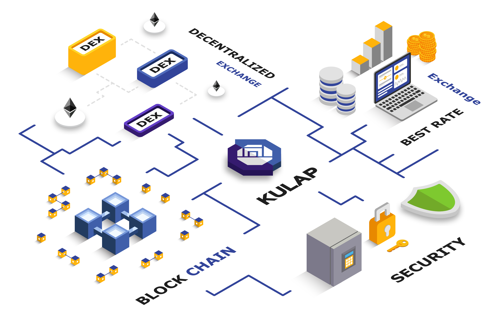

# Getting Started

## Introduction



KULAP aims to accelerate programmatic buying and selling of digital assets, our audited protocol aggregates liquidity from worldwide exchanges ensures that you and your company are being given the best rate when making swaps using ETH and ERC-20 tokens.


## Quick Start

The easiest way to integrate DEX trading into your platform without maintenance works is to use SDK to access, allows your users to make the best trade from the DEX with the best rate.

Please check out the SDK section for more details.

Example: Swap 100 DAI to LINK

```
const srcToken = "DAI"
const destToken = "LINK"
const amountIn = "100000000000000000000" // 100 DAI in Wei unit

const order = await kulapSDK.getRate(baseToken, pairToken, amountIn) // Get best rate from off-chain API

const isApproved = await kulapSDK.validate(order) // Check allowance of DAI token to Kulap DEX smart contract is made

if (!isApproved) {
  await kulapSDK.approve(order) // Giving a permission to Kulap DEX smart contract, the rights to transfer DAI
}

await kulapSDK.trade(order) // Execute trade

```
### Demo Dapp

We've build the demo dapp that allows you to quickly look up quickly look up how first sample application is made.

[https://demo-sdk.kulap.io/](https://demo-sdk.kulap.io/)

Source code :

[https://github.com/pisuthd/kulap-demo-dapp](https://github.com/pisuthd/kulap-demo-dapp)
